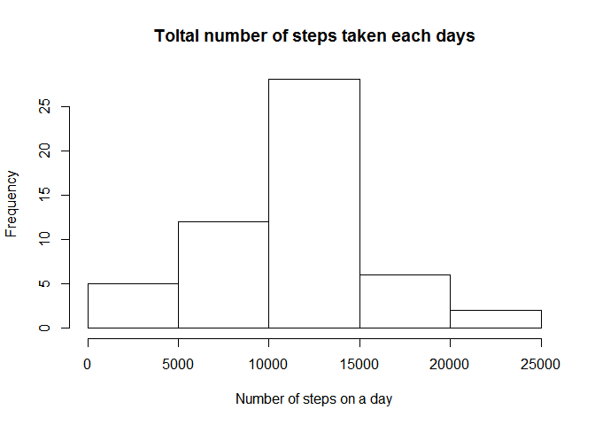
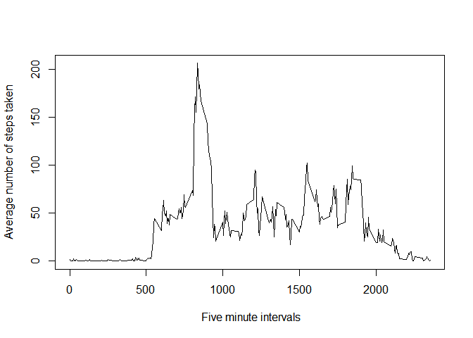
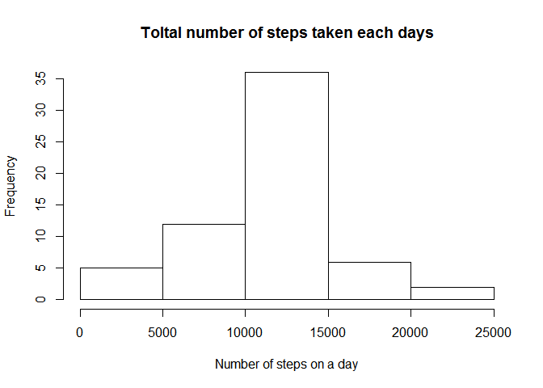
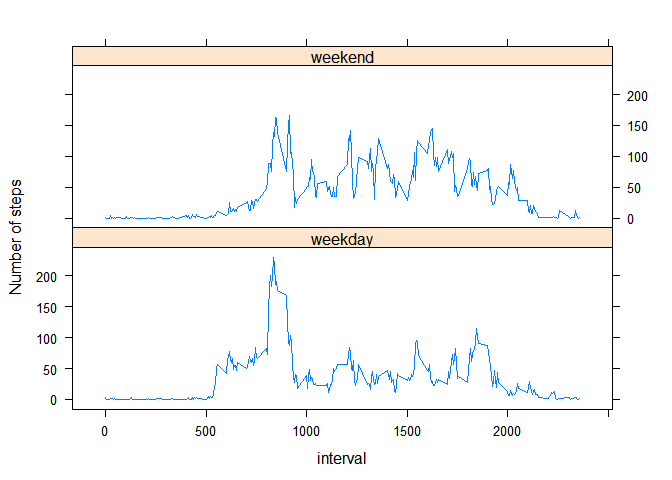

## Loading and preprocessing the data

```r
library(lubridate)
```

```
## 
## Attaching package: 'lubridate'
```

```
## The following object is masked from 'package:base':
## 
##     date
```

```r
library(dplyr)
```

```
## 
## Attaching package: 'dplyr'
```

```
## The following objects are masked from 'package:lubridate':
## 
##     intersect, setdiff, union
```

```
## The following objects are masked from 'package:stats':
## 
##     filter, lag
```

```
## The following objects are masked from 'package:base':
## 
##     intersect, setdiff, setequal, union
```

```r
library(lattice)
localZip <- "activity.zip"
unzipped <- "activity.csv" 
if (!file.exists(unzipped)){ unzip(localZip)}
d<-read.table(file="activity.csv", header=TRUE, sep=",")
d$date<-as.Date(d$date, "%Y-%m-%d")
```


## What is mean total number of steps taken per day?

```r
x_sum<-d[!is.na(d$steps),] %>%
    group_by(date) %>%
    summarize(total_step=sum(steps))
hist(x_sum$total_step, main = "Toltal number of steps taken each days", xlab="Number of steps on a day")
```

<!-- -->

```r
print(paste("Mean of total number of steps taken per day:", mean(x_sum$total_step)))
```

```
## [1] "Mean of total number of steps taken per day: 10766.1886792453"
```

```r
print(paste("Median of total number of steps taken per day:", median(x_sum$total_step)))
```

```
## [1] "Median of total number of steps taken per day: 10765"
```


## What is the average daily activity pattern?

```r
x_mean<-d[!is.na(d$steps),] %>%
    group_by(interval) %>%
    summarize(mean_step=mean(steps))
plot(x_mean, type="l", ylab="Average number of steps taken", xlab=" Five minute intervals")
```

<!-- -->

```r
print(paste("The 5-minute interval, that contains the maximum number of steps:", as.numeric(x_mean[x_mean$mean_step==max(x_mean$mean_step), 1])))
```

```
## [1] "The 5-minute interval, that contains the maximum number of steps: 835"
```


## Imputing missing values

```r
print(paste("Total number of missing values in the dataset:", sum(is.na(d))))
```

```
## [1] "Total number of missing values in the dataset: 2304"
```

```r
d_nona<-d
for (i in 1:nrow(d_nona)){
    if (is.na(d_nona[i,'steps'])) d_nona[i,'steps']<-x_mean[x_mean$interval==d_nona[i,'interval'],2]
}
x_sum<-group_by(d_nona,date) %>%
    summarize(total_step=sum(steps))
hist(x_sum$total_step, main = "Toltal number of steps taken each days", xlab="Number of steps on a day")
```

<!-- -->

```r
print(paste("Mean of total number of steps taken per day:", mean(x_sum$total_step)))
```

```
## [1] "Mean of total number of steps taken per day: 10766.1886792453"
```

```r
print(paste("Median of total number of steps taken per day:", median(x_sum$total_step)))
```

```
## [1] "Median of total number of steps taken per day: 10766.1886792453"
```

```r
print("These values do not differ from the estimates from the first part of the assignment. Imputing missing data increases the total daily number of steps")
```

```
## [1] "These values do not differ from the estimates from the first part of the assignment. Imputing missing data increases the total daily number of steps"
```


## Are there differences in activity patterns between weekdays and weekends?

```r
x_weekday<-mutate(d_nona, weekday_weekend=weekdays(d_nona$date))
for (i in 1:nrow(x_weekday)){
    if (x_weekday[i,'weekday_weekend']=="szombat" | x_weekday[i,'weekday_weekend']=="vasárnap"){
        x_weekday[i,'weekday_weekend']<- "weekend"
    }
    else x_weekday[i,'weekday_weekend']<- "weekday"
}
x<-group_by(x_weekday, interval, weekday_weekend) %>%
    summarize(average_step=mean(steps))
xyplot(average_step~interval | weekday_weekend, data=x, layout=c(1,2), type="l", ylab='Number of steps' )
```

<!-- -->


